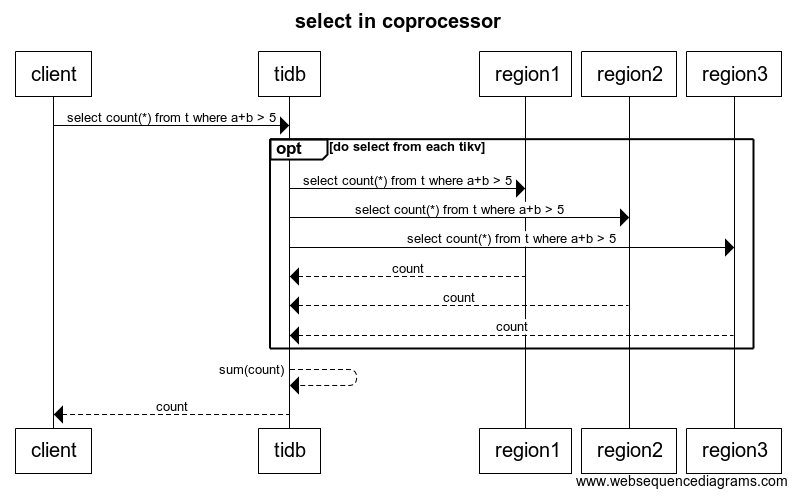

# Distributed SQL 

By now we already know how [TiDB]'s relational structure is encoded into the Key-Value form with version.  In this section, we will focus on the following questions:

* What happens when [TiDB] receives a SQL query?
* How does [TiDB] excute SQL queries in a distributed way?
  
## What happens when [TiDB] receives a SQL query?

Firstly, let's have a look at the following example:

```
   select count(*) from t where a + b  > 5;
```


As described in the above figure, when [TiDB] receives a SQL query from the client, it will process with the following steps:

1. [TiDB] receives a new SQL from the client.
2. [TiDB] prepares the processing plans for this request, meanwhile [TiDB] gets a timestamp from [PD] as the `start_ts` of this transaction.
3. [TiDB] tries to get the information schema (metadata of the table) from TiKV.
4. [TiDB] prepares Regions for each related key according to the information schema and the SQL query. Then [TiDB] gets information for the related Regions from [PD].
5. [TiDB] groups the related keys by Region.
6. [TiDB] dispatches the tasks to the related TiKV concurrently.
7. [TiDB] reassembles the data and returns the data to the client.

##  How does [TiDB] excute SQL queries in a distributed way?

In short, [TiDB] splits the task by Regions and sends them to TiKV concurrently.

For the above example, we assume the rows with the primary key of table `t` are distributed in three Regions:

* Rows with the primary key in [0,100) are in Region 1.
* Rows with primary key in [100,1000) are in region 2.
* Rows with primary key in [1000,~) are in region 3.

Now we can do `count` and sum the result from the above three Regions.



### Exectors

Now we know [TiDB] splits a read task by Regions, but how does TiKV know what are its tasks to handle?
Here [TiDB] will send a Directed Acyclic Graph (DAG) to TiKV with each node as an executor.


Supported executors:

* TableScan: Scans the rows with the primary key from the KV store.
* IndexScan: It will scan the index data from the KV store.
* Selection: performs a filter (mostly for `where`). The input is `TableScan` or `IndexScan`.
* Aggregation: performs an aggregation (e.g. `count(*)`,`sum(xxx)`). The input is `TableScan`,`IndexScan`, or`Selection`.
* TopN: sorts the data and returns the top n matches, for example, `order by xxx limit 10`. The input is `TableScan`,`IndexScan`, or`Selection`.


For the above example, we have the following executors on Region 1:

*  Aggregation: `count(*)`.
*  Selection: `a + b > 5`
*  TableScan: `range:[0,100)`.


### Expression

We have executors as nodes in the DAG, but how do we describe columns, constants, and functions in an `Aggregation` or a `Selection`? 
There are three types of expressions:

* Column: a column in the table.
* Constant: a constant, which could be a string, int, duration, and so on.
* Scalar function: describes a function.


For the above example `select count(*) from t where a + b > 5`, we have:

* Column: a, b.
* Scalar functions: `+`,`>`.
* Constant: `5`.


[TiDB]: https://github.com/pingcap/tidb
[PD]: https://github.com/pingcap/pd
